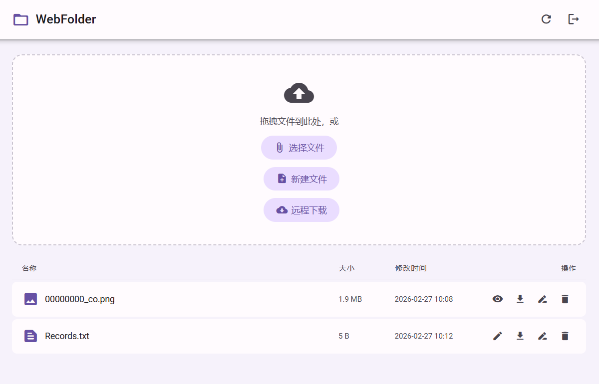

# 📁 WebFolder

A self-hosted, browser-based file manager with a clean Material Design interface.  
Access, upload, and manage your files from any device — protected by a password with a 30-day "remember me" cookie.


---

## 📸 Screenshot



---

## ✨ Features

| Feature | Description |
|---------|-------------|
| 🔐 Password protection | SHA-256 hashed password; 30-day cookie so you only log in once |
| 📤 Upload with progress | Drag-and-drop or file picker with real-time progress bar |
| 📥 Download with progress | Streaming download to your browser with progress bar |
| ☁️ Remote download | Paste any HTTP/HTTPS URL — the server fetches it in the background |
| ⏸️ Resume & retry | Remote downloads support breakpoint resume (Range requests) and automatic retry with exponential back-off (up to 3 times) |
| ⏱️ Timeout control | Per-request timeout (30 s) prevents indefinite hangs |
| ❌ Cancel download | Cancel any in-progress remote download with one click |
| 🔄 Task persistence | Reload the page without losing visibility of running remote downloads |
| 🗑️ Delete | One-click delete with confirmation dialog |
| ✏️ Rename | Rename files inline |
| 🖼️ Image preview | In-browser preview for common image formats |
| 📝 Text editor | Inline editor for `.txt`, `.json`, `.py`, and other plain-text files |
| 📄 New file | Create an empty file directly from the browser |
| 🎨 Material Design UI | Clean, responsive interface inspired by Google's Material Design 3 |

## 🚀 Quick Start

### Prerequisites

- Python 3.10 or higher
- pip

### Installation

```bash
# 1. Clone the repository
git clone https://github.com/hzq1995/WebFolder.git
cd WebFolder

# 2. (Optional) Create a virtual environment
python -m venv venv
source venv/bin/activate   # Windows: venv\Scripts\activate

# 3. Install dependencies
pip install -r requirements.txt

# 4. Set your password in config.py
#    Edit DEFAULT_PASSWORD in config.py before first run.

# 5. Run
python app.py
```

Open your browser at **http://localhost:5050** and log in with the password you set.

> **Tip:** To change the password, edit `DEFAULT_PASSWORD` in `config.py` and restart the server.

---

## ⚙️ Configuration

All settings live in [`config.py`](config.py):

| Key | Default | Description |
|-----|---------|-------------|
| `DEFAULT_PASSWORD` | `admin123` | **Change this!** Plaintext password (hashed at startup) |
| `SECRET_KEY` | `change-me-...` | Flask session secret – set a random string in production |
| `COOKIE_DAYS` | `30` | How long the auth cookie lasts (days) |
| `UPLOAD_FOLDER` | `./uploads` | Directory where files are stored |
| `MAX_CONTENT_LENGTH` | `20 GB` | Maximum single-file upload size |
| `HOST` | `0.0.0.0` | Bind address |
| `PORT` | `5050` | Listen port |

Remote download behaviour can be tuned at the top of [`app.py`](app.py):

| Constant | Default | Description |
|----------|---------|-------------|
| `_DOWNLOAD_MAX_RETRIES` | `3` | Max automatic retry attempts |
| `_DOWNLOAD_TIMEOUT` | `30` | Per-request timeout in seconds |
| `_DOWNLOAD_RETRY_DELAY` | `3` | Initial retry wait in seconds (doubles each time) |

---

## ☁️ Remote Download

1. Click **远程下载** in the upload area.
2. Paste an `http://` or `https://` URL. Optionally set a custom filename.
3. Click **开始下载** — the server fetches the file in the background.
4. A live progress card appears. You can **close or refresh the page** and the task continues; reopening the page restores all active tasks automatically.
5. Click the **✕** button on any task card to cancel the download.

**Resilience features:**
- **Breakpoint resume** — if the connection drops and the server supports `Range` requests, the download continues from where it left off.
- **Auto retry** — up to 3 retries with exponential back-off (3 s → 6 s → 12 s).
- **Timeout** — each request times out after 30 s to prevent hangs.
- **Cancel** — sets a flag checked every 64 KB chunk; stops immediately and deletes the partial file.

---

## 🔌 API Reference

All endpoints require a valid `wf_token` cookie except `/api/login`.

| Method | Endpoint | Description |
|--------|----------|-------------|
| `POST` | `/api/login` | Verify password, set auth cookie |
| `POST` | `/api/logout` | Clear auth cookie |
| `GET` | `/api/auth-check` | Check if current cookie is valid |
| `GET` | `/api/files` | List all files with metadata |
| `POST` | `/api/upload` | Upload a file (`multipart/form-data`) |
| `GET` | `/api/download/<filename>` | Stream-download a file |
| `DELETE` | `/api/delete/<filename>` | Delete a file |
| `GET` | `/api/preview/<filename>` | Get file content for preview/edit |
| `PUT` | `/api/edit/<filename>` | Save edited text-file content |
| `PATCH` | `/api/rename/<filename>` | Rename a file |
| `POST` | `/api/create` | Create a new empty text file |
| `POST` | `/api/remote-download` | Start a background remote download |
| `GET` | `/api/remote-download/tasks` | List all active remote download tasks |
| `GET` | `/api/remote-download/status/<id>` | Get status of a specific task |
| `DELETE` | `/api/remote-download/cancel/<id>` | Cancel a running task |

---

## 📂 Project Structure

```
WebFolder/
├── app.py              # Flask application & all API routes
├── config.py           # User-configurable settings
├── requirements.txt    # Python dependencies
├── uploads/            # Stored files (excluded from git)
└── static/
    ├── index.html      # Single-page frontend
    ├── css/
    │   └── style.css   # Material Design 3 custom styles
    └── js/
        └── app.js      # Frontend logic (vanilla ES2020+, no build step)
```

---

## 🤝 Contributing

1. Fork the repo and create a feature branch.
2. Make your changes with clear commit messages.
3. Open a Pull Request describing what changed and why.

Please open an issue first for major changes.

---

## 📄 License

Distributed under the [MIT License](LICENSE).
